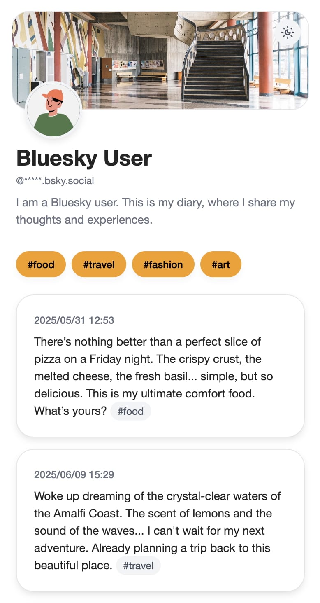
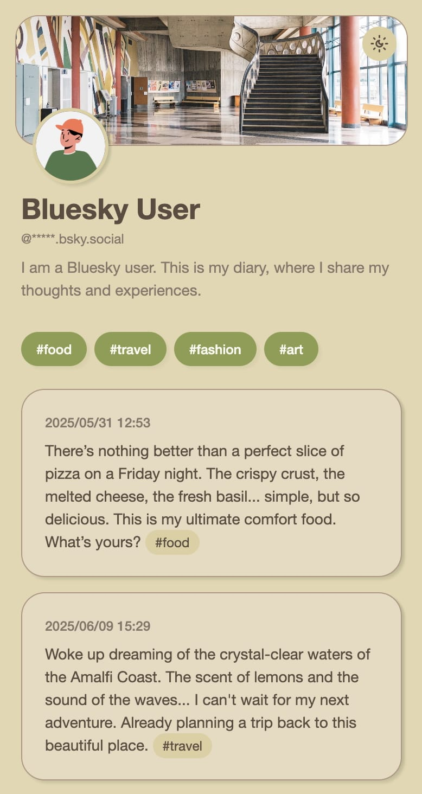
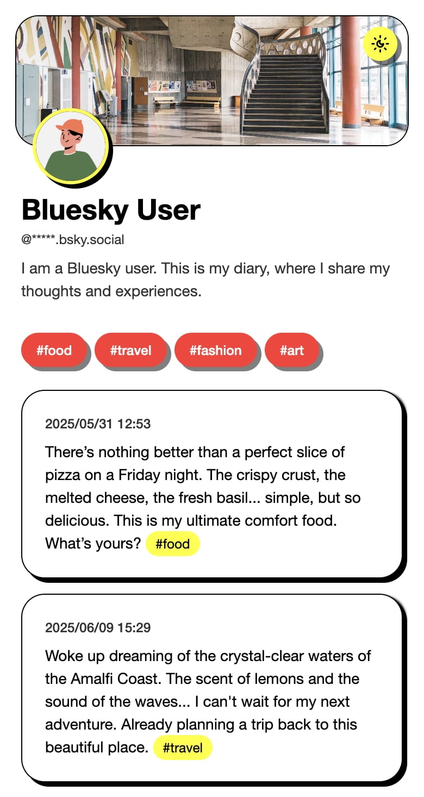

<h1>
   
</h1>

A full-stack web application for collecting and displaying Bluesky posts through the Jetstream firehose.



## Overview

This repository consists of two main components:

1. Web Application: A Next.js-based frontend for viewing and managing posts
2. Jetstream Listener: A backend service that connects to Bluesky's Jetstream firehose to collect posts

## Getting Started

### 1. Clone the repository

```bash
git clone https://github.com/tuanemuy/at-diary.git
cd at-diary
```

### 2. Set up environment variables

```bash
cp .env.example .env
# Edit .env with your configuration
```

### 3. Install dependencies

```bash
deno install
```

### 4. Run database migrations

```bash
deno task db:migrate --config drizzle.config.ts
```

### 5. Start development services

```bash
# Start Next.js server
deno task build
deno task start:next

# Start firehose listener
deno task start:firehose
```

## Development Commands

| Command | Description |
|---------|-------------|
| `deno task dev:next` | Start Next.js development server with Turbopack |
| `deno task dev:firehose` | Start the firehose listener in development mode |
| `deno task build` | Build the Next.js application |
| `deno task start:next` | Start the production Next.js server |
| `deno task start:firehose` | Start the firehose listener with watch mode |
| `deno task db:generate --config ${file}` | Generate database migrations with Drizzle |
| `deno task db:migrate --config ${file}` | Run database migrations |
| `deno task lint` | Run Biome linter |
| `deno task lint:fix` | Run Biome linter with auto-fix |
| `deno task format` | Format code with Biome |
| `deno test` | Run unit tests |

## Environment Variables

Create a `.env` file based on `.env.example`:

| Variable | Description |
|----------|-------------|
| `JETSTREAM_HOST` | Bluesky Jetstream WebSocket URL |
| `DID` | Bluesky DID to filter posts for |
| `TURSO_DATABASE_URL` | Turso database URL |
| `TURSO_AUTH_TOKEN` | Turso authentication token |
| `PGLITE_DATABASE_URL` | PGlite database URL (for testing, leave empty for in-memory) |

## Customization

### Application Settings

- Basic configuration: `src/app/config.ts`

### UI Themes

- Global styles: `src/styles/index.css`
- Theme samples: `src/styles/shadcn/*.css` (generated using [tweakcn.com](https://github.com/jnsahaj/tweakcn))

### Database Adapters

- To change database connections, refer to repository implementations in `src/core/adapters/${service}/${entity}Repository.ts`

## Screenshots





